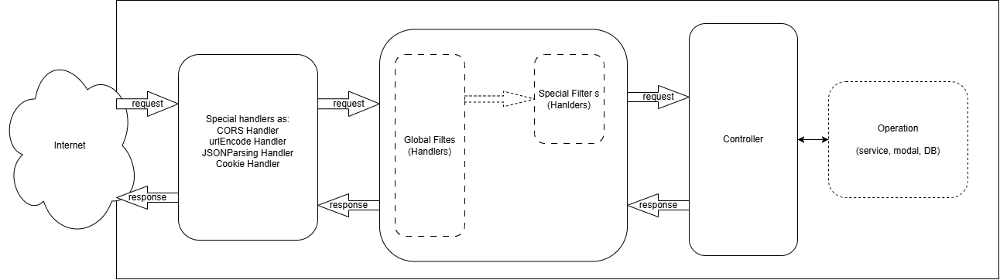

### **_For make sure the latest documents, Please refer documents in git [etcapi](https://github.com/binle/bakku-etcapi)_**

# 1. Overview

EtcAPA is a simple library (it can be considered as a framework) for creating APIs. The target is help developer create APIs easiest.

We use [reflect-metadata](https://rbuckton.github.io/reflect-metadata/) library for creating it. It works base on [expressjs](https://expressjs.com/) and it is similar with Spring Framework with anotations:

- [@Configuration](./docs/configuration.md)
- [@Controller](./docs/controller.md)
- [@Service](./docs//service.md)
- ..v..v..

# 2. Technical

This library (framework) work as this image.

# 3. Use & Sample

### 3.1 Use

&emsp;&emsp;npm: `npm install @bakku/etcapi`

&emsp;&emsp;yarn: `yarn install @bakku/etcapi`

### 3.2 Sample

Please see the [sample source code](./sample-etcapi/)

# 4. Documents

[All documents](https://github.com/binle/bakku-etcapi/tree/main/docs)

### 4.1 Anotaions

- [@Configuration](./docs/configuration.md)
- [@Controller](./docs/controller.md)
- [@Service](./docs//service.md)

### 4.2 Related

- [Customization](./docs/customization.md)
- [Logger](./docs/logger.md)
- [Schema](./docs/class-schema.md)
- [Validation](./docs/validate.md)
