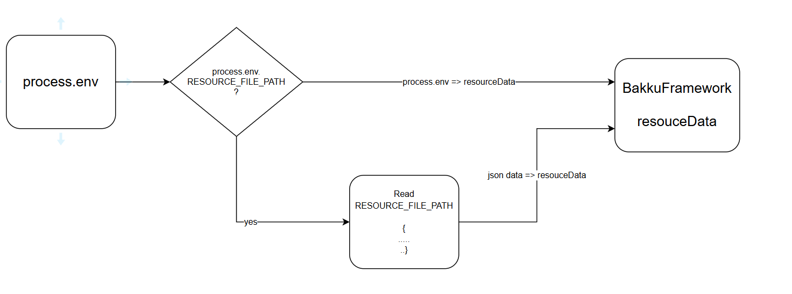

# 1 Install

&emsp;&emsp;npm: `npm install @bakku/etcapi`

&emsp;&emsp;yarn: `yarn add @bakku/etcapi`

# 2 Use

## 2.1 Overview


## 2.2 Use

- Declaration @Application

```
import {Application} from '@bakku/etcapi';

@Application()
class DemoApplication {

}
```

- Use directive

```
import {BakkuFramework} from '@bakku/etcapi';

BakkuFramework.start(); ==> localhost:8080

```

## 2.3 Application interface `IApplication`

- beforeStartApplication?(): void | Promise<void> => run before setup and start application
- beforeStartApplication?(): void | Promise<void>; => run after setup and start application

```
interface IApplication {
  beforeStartApplication?(): void | Promise<void>;
  afterStartApplication?(): void | Promise<void>;
}
```

Example:

```
import {BakkuFramework, IApplication, Application} from '@bakku/etcapi';

@Application
class DemoApplication implement IApplication {
  beforeStartApplication(): void | Promise<void> {
    const expressApp = BakkuFramework.getExpressApp();
    expressApp.use(express.static(path.join(__dirname, 'public')));
    // if you have some static folder, you have to set in this function
  }

  afterStartApplication(): void | Promise<void>{
    const expressApp = BakkuFramework.getExpressApp();
    expressApp.disable('x-powered-by');
    expressApp.engine('html', ejs.renderFile);
    expressApp.set('views', path.join(__dirname, 'views'));

    const resourceData = BakkuFramework.getResourceData();
    console.log(` === application is starting at port ${resourceData.port }====`);
  }
}
```

# 3 Environment, resources

- By default, you can set the resource config to the environment of nodejs(process.env), refer - [environment-variables-from-nodejs](https://nodejs.org/en/learn/command-line/how-to-read-environment-variables-from-nodejs)

- Use resource json file, use RESOURCE_FILE_PATH in node environment (process.env.RESOURCE_FILE_PATH). When you pass this property in node environment, we will prefer to read the data from `RESOURCE_FILE_PATH`. Note: It has been json file.
  

- The resource data will be keep `BakkuFramework.getResourceData()`

- Example: `RESOURCE_FILE_PATH='./resource/dev.json' node start ./dist/index.js`
